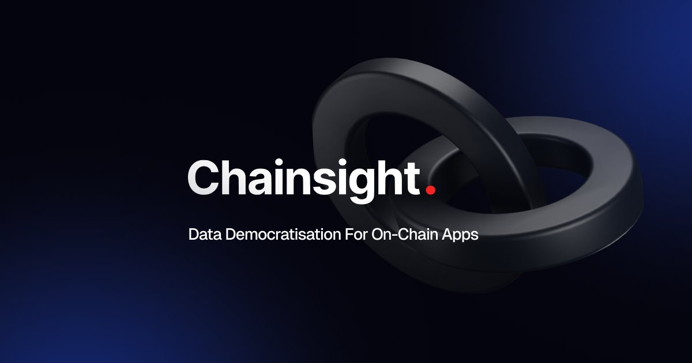
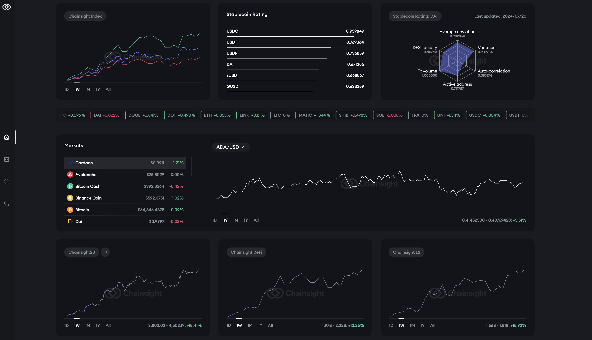
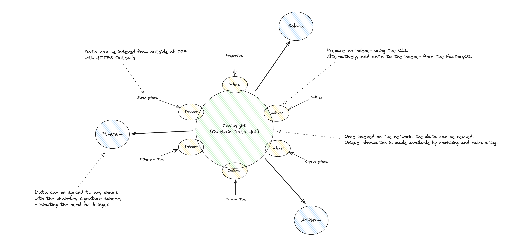

# Introduction

<figure><figcaption></figcaption></figure>

Chainsight is an advanced on-chain data hub that aggregates data from various markets and makes it accessible on-chain. Any data can be accessed from smart contracts, including data that can be retrieved from HTTPS endpoints on the web, results calculated from huge amounts of data, and states from other chains.

→ [Motivation](chainsight-overview/motivation.md)

→ [How to use Chainsight?](chainsight-overview/how-to-use-chainsight.md)

→ [FAQ](chainsight-overview/faq.md)

<figure><figcaption></figcaption></figure>

The Chainsight UI enables users to access data indexed in Chainsight via a customizable dashboard. Users can select specific charts to display their data and create a personalized dashboard with their preferred layout. This allows users to view and analyze exclusive data available only through Chainsight, including unique indexes and rating information.

\-> [Product](https://app.chainsight.network/)

\-> Available Data List (Coming Soon)

<figure><figcaption></figcaption></figure>

Chainsight is a network consisting of a large number of indexers. Each individual indexer has its own data, which can be combined to efficiently build new data. This new data can be written directly to blockchains, such as Ethereum, eliminating the need for off-chain bridges. This allows on-chain applications to utilize the data they need.

\-> [Architecture](chainsight-architecture/system-outline.md)
