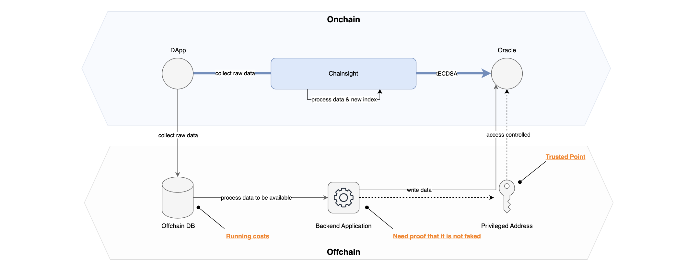

# On-Chain Data Flow

In traditional scenarios, leveraging on-chain data for new applications often involves utilizing off-chain resources. Event data and other relevant information are typically stored in an off-chain database. The necessary data is then extracted for back-end applications, and an authorized address writes the data to the Oracle contract. This approach, illustrated in a gray box below, entails high maintenance costs for the back end, and the back-end provider itself becomes a trust point.

<figure><figcaption>
Comparison with conventional data flow
</figcaption></figure>

Chainsight eliminates the need for off-chain setups and establishes a seamless on-chain data processing pipeline. To achieve this, users simply need to select the data source and define some basic logic to transform the raw data into useful information. This on-chain approach reduces the reliance on trust points and provides a more cost-effective solution for utilizing on-chain data in applications.

#### Collecting Raw Data across On-Chain

Chainsight collects arbitrary data from arbitrary blockchains. There are two main types of data: event data, as represented by Transfer in ERC-20, and data that is periodically retrieved from a view function for the current value. HTTP calls are periodically made to the blockchain nodes to update Chainsight's data to the latest state. The interval to be retrieved can be specified by the Indexer owner. Once the data is indexed on the chain site, anyone is free to use it as a data source. Data can be combined and customized freely for efficient and meaningful on-chain data.

#### Threshold ECDSA

Data on Chainsight can be taken out to other blockchains. ECDSA signing can be performed without reconstructing the private key using secret shares generated on multiple distributed nodes. This allows for immediate transactions with decentralized key management when writing one piece of data to another blockchain. Users do not need to worry about the Threshold ECDSA mechanism but simply specify from the UI which data to write in which chain. To learn more about the mechanism, please jump [here](https://github.com/horizonx-tech/ic-web3-rs).

