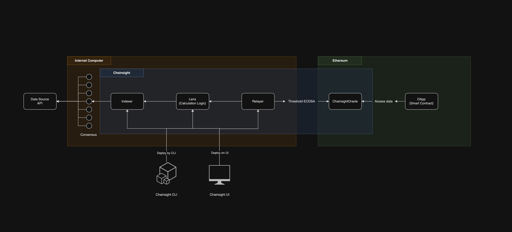

# System Outline

The Chainsight architecture can be summarized as follows:

<figure><figcaption></figcaption></figure>

### Data Source Verification

When retrieving data, the canister makes 13 HTTP calls to ensure its accuracy before indexing it on-chain.

### Updating Smart Contracts without Off-Chain Bridges

Chainsight is built on Internet Computer's [Chain-key Cryptography](https://support.dfinity.org/hc/en-us/articles/360057605551-What-is-chain-key-cryptography-), enabling data synchronization with any L1/L2 in a trustless manner.

### Cost-Efficiency through Composability

Data is initially indexed into the storage of canister smart contracts on the Internet Computer. These canister smart contracts are then connected like Lego blocks, allowing for the handling of more complex data at a low cost. Components deployed by developers using the CLI or UI run on the Internet Computer as Composable Data Oracles.

In addition, Chainsight has deployed Management Canisters to oversee the entire network. Incentives for data providers and mechanisms to identify corrupt data will be implemented in future milestones.
